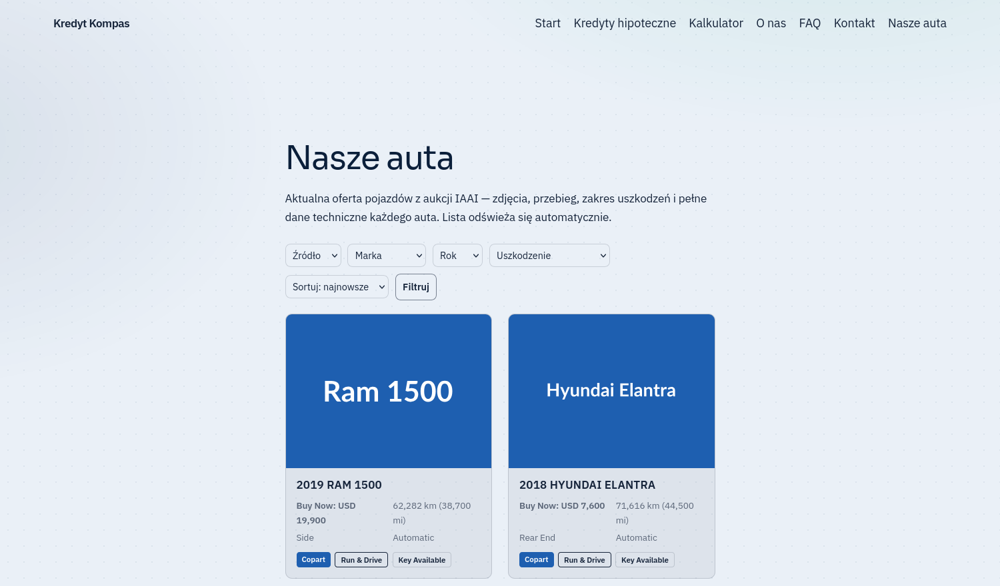

<div align="center">

# IAAI Importer — klikalne demo

**Jeden link stawia WordPressa z wtyczką w Twojej przeglądarce.**
Uruchamia się podstrona „Nasze auta" z ofertą pojazdów z aukcji: karty ze zdjęciem,
ceną Buy Now, przebiegiem i uszkodzeniem, filtry marki, rocznika i typu uszkodzenia,
sortowanie i paginacja. Nic nie trzeba instalować ani konfigurować.

[▶ Otwórz demo](https://playground.wordpress.net/?blueprint-url=https://raw.githubusercontent.com/krzysiek2115op/iaai-importer-demo/main/blueprint.json) ·
[Kod źródłowy wtyczki](https://github.com/krzysiek2115op/copart-iaai-importer) ·
[Licencja GPL-2.0+](LICENSE)

<br>

[](https://playground.wordpress.net/?blueprint-url=https://raw.githubusercontent.com/krzysiek2115op/iaai-importer-demo/main/blueprint.json)

</div>

---

## Link do wysłania klientowi

```
https://playground.wordpress.net/?blueprint-url=https://raw.githubusercontent.com/krzysiek2115op/iaai-importer-demo/main/blueprint.json
```

## Co widać w demie

- **Podstrona „Nasze auta"** tworzona automatycznie po włączeniu wtyczki
  i wpinana w menu — klient nie musi jej zakładać.
- **Karty pojazdów** ze zdjęciem, ceną „Buy Now", przebiegiem (km i mile),
  rodzajem uszkodzenia i plakietkami *Copart* / *IAAI* / *Run & Drive* / *Key Available*.
- **Pasek filtrów** (źródło, marka, rocznik, uszkodzenie, sortowanie) i paginacja.
- Wygląd **dziedziczy motyw** strony — u klienta dopasuje się do jego szablonu.

## Czego demo NIE pokazuje

Uczciwie, bo to prezentacja, nie produkt:

| Rzecz | Jak jest w demie | Jak jest u klienta |
|---|---|---|
| **Zdjęcia pojazdów** | Kolorowe kafle z nazwą modelu (`placehold.co`) | Prawdziwe zdjęcia hotlinkowane z serwerów aukcji — **0 MB na dysku klienta** |
| **Dane pojazdów** | Atrapa wstawiona przez mu-plugin | Scraper w Pythonie na VPS, cron/systemd, crawl → normalizacja → dedup → audyt |
| **Trwałość** | Znika po odświeżeniu karty | Własna baza MySQL, wtyczka czyta ją tylko do odczytu |
| **Pasek administratora** | Widoczny — blueprint ma `"login": true`, żeby dało się zajrzeć do kokpitu | Odwiedzający strony klienta go nie widzi |
| **Wersja wtyczki** | **0.30.0** — paczka `iaai-importer.zip` w tym repo | **0.30.6** ([źródło](https://github.com/krzysiek2115op/copart-iaai-importer)) |

> ℹ️ **O różnicy wersji.** Paczka w demie jest o sześć wydań starsza od produktu.
> Różnica to procedura odinstalowania (`uninstall.php`) i migracja klucza głównego
> pod dwa źródła danych — **żadna z nich nie jest w demie widoczna**. Paczka nie
> została podmieniona świadomie: podmiana bez uruchomienia dema od zera znaczyłaby
> wystawienie klientowi linku, którego nikt nie sprawdził. Odświeżenie wymaga
> przebiegu `npx @wp-playground/cli server --blueprint=blueprint.json` i obejrzenia
> wyniku.

## Zawartość repo

| Plik | Rola |
|---|---|
| `blueprint.json` | Scenariusz startowy Playground: motyw, wtyczka, treść, dane demo |
| `iaai-importer.zip` | Wtyczka WordPress — ta sama paczka, którą dostaje klient |
| `iaai-demo-seed.php` | mu-plugin: wstawia przykładowe auta i zezwala na obrazki demo |
| `kredyt-kompas-content.php`, `kredyt-kompas.css` | Fikcyjna witryna klienta, w której wtyczka jest pokazywana |

Wszystkie cztery zasoby blueprint pobiera przez `raw.githubusercontent.com`
z gałęzi `main` tego repozytorium — dlatego musi ono zostać publiczne.

## O nazwie „Kredyt Kompas"

Demo działa na **fikcyjnej witrynie klienta**, żeby pokazać wtyczkę tam, gdzie
faktycznie pracuje: w istniejącej stronie firmowej, a nie na pustym WordPressie.
Ta sama fikcyjna marka wraca w dwóch innych projektach —
[`kredyt-kompas-demo`](https://github.com/krzysiek2115op/kredyt-kompas-demo)
(strona statyczna) i
[`mp-offer-automation-suite`](https://github.com/krzysiek2115op/mp-offer-automation-suite)
(demo pakietu ofertowego).

## Licencja

**GPL-2.0-or-later** ([LICENSE](LICENSE)) — tak samo jak dołączona wtyczka, która
deklaruje tę licencję w swoim nagłówku, i tak samo jak
[repozytorium źródłowe](https://github.com/krzysiek2115op/copart-iaai-importer).

Wcześniej repo miało licencję MIT, co było sprzeczne: MIT na poziomie repozytorium
sugerowałby, że dołączona paczka GPL też jest na MIT. Wtyczka WordPressa nie może
być na MIT, jeśli dziedziczy z rdzenia — a licencja repo nie ma prawa mówić czegoś
innego niż nagłówek pliku w środku.
